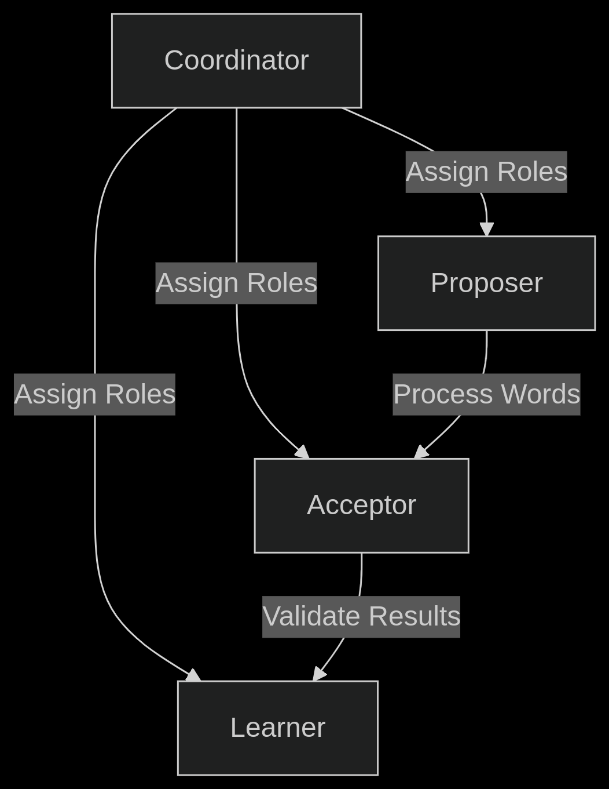
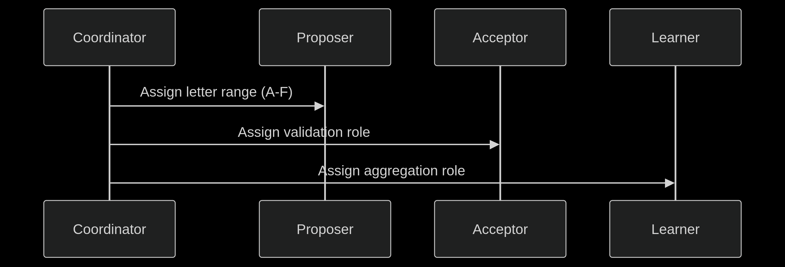

# 🚀 Distributed Election Service with Kafka

---

## 🌟 Features

| Feature             | Description                                                   |
|---------------------|---------------------------------------------------------------|
| Leader Election     | Bully algorithm implementation                                |
| Role Assignment     | Dynamic coordinator/proposer/acceptor/learner roles            |
| Document Processing | Distributed word counting based on letter ranges             |
| Fault Tolerance     | Automatic failure detection and recovery                      |
| Visual Monitoring   | Formatted console output with real-time node status            |

---

## 🏗 Architecture Diagram

  

---

## 🚦 Getting Started

### Prerequisites

- Java 17+
- Apache Kafka 3.4+
- Maven 3.8+

### Start Multiple Instances

Run multiple nodes easily with the following command:

for PORT in {8081..8088}; do
  gnome-terminal -- bash -c "java -jar target/esad-0.0.1-SNAPSHOT.jar --server.port=$PORT; exec bash";
  sleep 1;
done

⚙ Configuration
Edit src/main/resources/application.properties:

properties
# Kafka Configuration
spring.kafka.bootstrap-servers=localhost:9092
spring.kafka.consumer.group-id=election-cluster

# Timeout Settings (ms)
election.timeout=5000
heartbeat.interval=2000

🔄 System Flow
Initialization Phase

Nodes start as candidates

Bully algorithm elects coordinator

## 2. Role Assignment
- Roles are dynamically assigned (Coordinator, Proposer, Acceptor, Learner).

  

Document Processing

Coordinator splits document by first letter

Proposers count words in their range

Acceptors validate counts

Learner aggregates final results

📜 Logging Examples
Election Log:

╔══════════════════════════════════════════════╗
║           COORDINATOR ELECTED               ║
╠──────────────────────────────────────────────╣
║ Node: node-742                              ║
║ Role: COORDINATOR                          ║
║ Cluster Size: 3                            ║
╚══════════════════════════════════════════════╝
Processing Log:

[12:34:56][node-742][PROPOSER] Processed 42 words for letter B
📄 License
This project is licensed under the MIT License - see the LICENSE file for details.

 <i>✨ "Distributed systems shouldn't be a mystery" ✨</i> 
 
